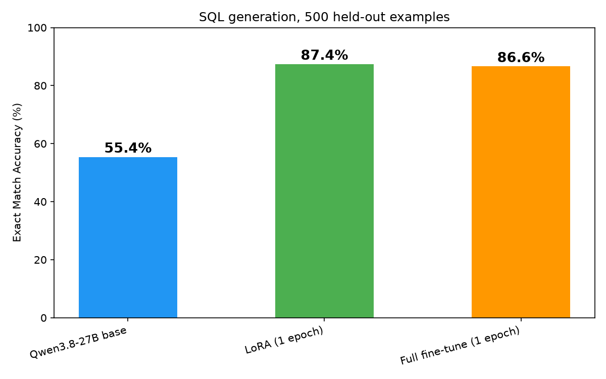
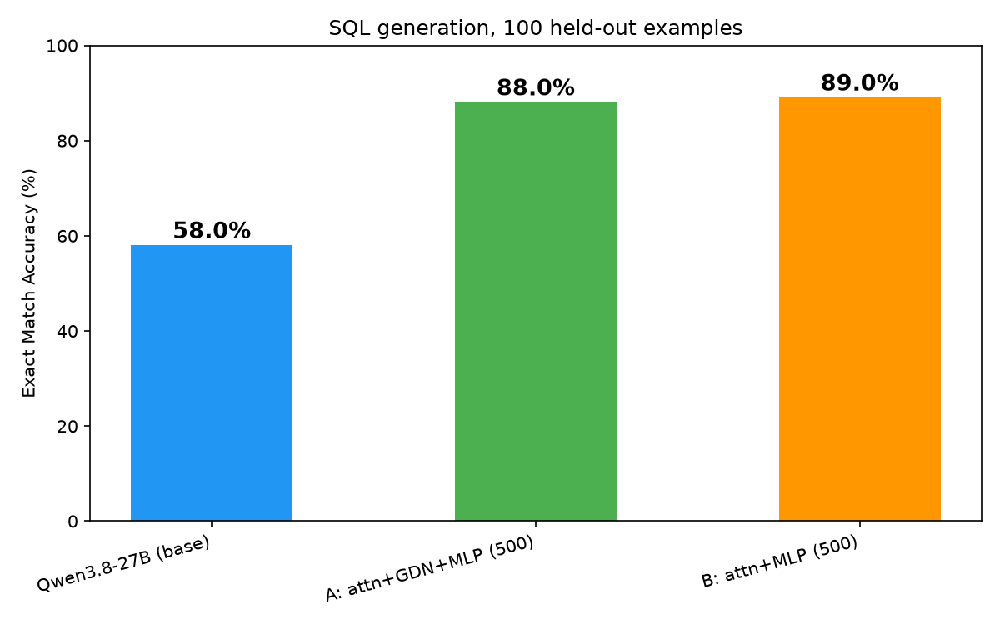

# Results: fine-tuning Qwen3.8-27B for SQL on 16× B300

Everything here was measured on the cluster described below, between 2026-09-07
and 2026-09-08. Where a number was previously estimated and later measured, the
measured value is given and the estimate is called out — several of the
estimates were wrong.

- [Headline](#headline)
- [The cluster](#the-cluster)
- [The task](#the-task)
- [What the metric measures](#what-the-metric-measures) ← read this before comparing to other numbers
- [LoRA vs full fine-tuning](#lora-vs-full-fine-tuning)
- [Does LoRA need the Gated DeltaNet layers?](#does-lora-need-the-gated-deltanet-layers)
- [Performance and memory](#performance-and-memory)
- [Defects found by running it](#defects-found-by-running-it)
- [What was not measured](#what-was-not-measured)
- [Reproducing](#reproducing)

---

## Headline



500 held-out examples, greedy decoding, one epoch of training for each tuned model.

| Model | Accuracy | Correct | vs base | Usable as-is |
|---|---|---|---|---|
| Qwen3.8-27B base | 55.4% | 277/500 | — | 1.6% |
| **LoRA (1 epoch)** | **87.4%** | 437/500 | **+32.0pp** | 86.8% |
| Full fine-tune (1 epoch) | 86.6% | 433/500 | +31.2pp | 86.0% |

**Full fine-tuning is statistically indistinguishable from LoRA on this task.**
Paired over the same 500 examples: both correct 428, both wrong 58, LoRA-only 9,
full-only 5 — 14 discordant pairs, exact McNemar **p = 0.42**. LoRA's nominal
0.8pp lead is noise.

That is the practical result: **a 4.3 GB adapter matched a 51 GB full checkpoint**,
and the full fine-tune's only measured advantages are that it trains 21% faster
and needs no merge step.

Raw data: [`results-three-way-n500.md`](results-three-way-n500.md) ·
[`results-three-way-n500.json`](results-three-way-n500.json) (all 500 predictions
from all three models).

---

## The cluster

Measured with `nvidia-smi` and `sinfo`, not read off a spec sheet.

| | |
|---|---|
| Nodes | 2 × `worker-b300`, Slurm 25.11.3 (Nebius Soperator) |
| GPUs | 8 × NVIDIA B300 SXM6 per node, **sm_103**, 16 total |
| HBM | **268.6 GiB per GPU** (288.4 GB) → **4.20 TiB across the cluster** |
| Host RAM | 2.66 TiB per node (2,487 GiB Slurm-allocatable), 192 vCPU |
| Storage | shared filesystem at `/mnt/data`; `/tmp` is **node-local** |
| Driver / CUDA | 580.159.04 / CUDA 13.0, torch 2.13.0+cu130, vLLM 0.28.0, transformers 5.16.1 |

Two storage facts that shaped everything: **write throughput depends on file
shape** (~40 MB/s for many small files, **~214 MiB/s** for large sequential
safetensors shards), and `/tmp` being node-local means worker jobs cannot see
anything written there.

---

## The task

[`b-mc2/sql-create-context`](https://huggingface.co/datasets/b-mc2/sql-create-context):
natural-language question + `CREATE TABLE` schema → SQL query.

| | |
|---|---|
| Raw `train` split | 78,577 examples |
| After 95/5 seed-42 split | **74,648 train / 3,929 held out** |
| Tokens per epoch | ~8.4 M (mean 112 tokens/example, max 239) |
| One epoch | **584 optimizer steps** at effective batch 128 (8/GPU × 16 GPUs) |

`MAX_SEQ_LEN=1024` never truncates — the longest example is 239 tokens. Both
tuned models saw **100% of the training data, exactly once**.

---

## What the metric measures

**Read this before comparing these numbers to any others.** This is the single
biggest source of confusion we hit, and it cost a day.

Accuracy is exact match after `normalize_sql`, which **extracts** the SQL from
the response (a closed ```` ```sql ```` block if present, otherwise from the last
`SELECT`, cut at the first terminator), strips chat-template artefacts,
normalises `'single'` → `"double"` quotes, then lowercases and collapses
whitespace. It is ported verbatim from the reference implementation in
[`kreuzhofer/dgx-manager-fine-tune-recipes`](https://github.com/kreuzhofer/dgx-manager-fine-tune-recipes)
so results here are directly comparable with the Qwen3.6/3.8 runs measured on
DGX Spark.

**Without those two steps the base model scores 1%.** Measured on 100 examples,
adding one normalisation at a time:

| normalisation | base | tuned |
|---|---|---|
| lowercase + whitespace + trailing `;` only | **1%** | 72% |
| + strip markdown fences | 3% | 72% |
| + normalise quote style | 16% | 73% |
| **+ both (the metric used here)** | **58%** | 73% |

72 of 100 base answers arrive wrapped in a markdown fence, and the base writes
**ANSI-standard `'single'` quotes** while this dataset stores non-standard
`"double"` ones. Neither is a SQL error. An earlier version of this repo
reported the base at 1% as its headline; that was a harness defect, not a
property of the model.

Ruled out as explanations, by measurement:

- **Not the prompt.** Three prompt variants were run against the base model
  served through vLLM. It produced double quotes **0–1 times in 100** in every
  one. Our prompt was also the best of the three (58% vs 17% for a bare
  sharegpt-style prompt, which makes the model write prose before the SQL).
- **Not the engine.** Identical messages through vLLM and through
  `transformers.generate()` score identically.

The **"usable as-is"** column is the same comparison with no extraction and no
quote handling. It answers "can I use this output without post-processing",
which is a real question — it is simply not a measure of SQL correctness.
The gap between the two columns (1.6% → 86.8%) is what fine-tuning mostly buys.

---

## LoRA vs full fine-tuning

Both trained one epoch, 584 steps, same data, same batch, on 16 GPUs.

| | LoRA (attn+MLP, r=32) | Full fine-tune |
|---|---|---|
| Trainable | 159,383,552 (0.589%) | 27.1 B (100%) |
| **Accuracy (N=500)** | **87.4%** | 86.6% |
| Wall clock, 1 epoch | 15.1 min | **11.9 min** |
| Per step | 1.55 s | **1.22 s** |
| Peak GPU memory | 29.08 GiB alloc / 63.83 reserved | 35.45 GiB alloc / 49.78 reserved |
| Artifact on disk | **4.3 GB adapter** | 51 GB checkpoint |
| Extra step needed | merge (~4 min) | none |
| Final eval loss | **0.01691** | 0.01873 |

**Full fine-tuning ran the epoch 21% faster while training 170× more parameters**,
which surprised us. Under FSDP `full_shard` the dominant per-step cost is the
parameter all-gather for forward and backward, and **both paths pay it in full**.
LoRA saves on the optimizer update and gradient traffic — neither of which
dominates here — while adding PEFT wrapper overhead across 256 modules and still
running the entire base model forward and backward. About 15% of the gap survives
correcting for the mid-run checkpoint the LoRA run wrote and the full run skipped.

So on this hardware, **LoRA's advantages are portability and disk, not speed**:
4.3 GB versus 51 GB, and you keep one shared copy of the base weights.

Memory is not the constraint either way. Full fine-tuning of 27 B peaked at
**35.45 GiB per GPU — 13% of a 268.6 GiB card**. On the H100-era version of this
demo, full fine-tuning a *smaller* 32 B model OOM'd on 16×80 GB and had to fall
back to LoRA.

---

## Does LoRA need the Gated DeltaNet layers?

Qwen3.8-27B is hybrid: of 64 layers, only 16 use classic attention; the other 48
are Gated DeltaNet linear attention. The intuitive inference — that a Qwen3-era
`q/k/v/o` + MLP target list adapts only a quarter of the token-mixing blocks and
must be leaving capability unused — **is wrong**, and this repo shipped it as
fact until it was tested.

Two arms, identical seed, data, rank and steps; only the target list differs.

| steps | attn + **GDN** + MLP | attn + MLP | won only by A | won only by B | McNemar p |
|---|---|---|---|---|---|
| 25 | 74% | 75% | **0** | 1 | 1.000 |
| 500 | 88% | **89%** | **0** | 1 | 1.000 |



`eval_loss` at 500 steps: 0.01749 vs 0.01754 — a difference in the fifth decimal.

**Across two independent runs at two scales, there is not one held-out example
the GDN adapters get right that the narrow list misses.** The broad list costs
58.2 M extra trainable parameters (0.803% vs 0.589%) and **~15% throughput per
step** to change a single prediction, in the wrong direction. `LORA_TARGET_GDN`
therefore defaults to `0`.

**Scope of that claim:** the arms are not capacity-matched at equal rank — the
broad list carries 1.37× the trainable parameters. This measures *which shipped
configuration is better*, not *whether GDN placement matters in principle*. The
latter needs a rank-matched arm (attn+MLP at r≈44).

The 25-step chart ([`gdn-ab-25step.png`](images/gdn-ab-25step.png)) shows the
same pattern at 4.3% of an epoch.

---

## Performance and memory

| | |
|---|---|
| LoRA, 1 epoch | 584 steps in 907.5 s (1.55 s/step) |
| Full FT, 1 epoch | 584 steps in 715.2 s (1.22 s/step) |
| Peak memory, LoRA | 29.08 GiB allocated / 63.83 GiB reserved |
| Peak memory, full FT | 35.45 GiB allocated / 49.78 GiB reserved |
| Merge (LoRA → standalone) | 4 min 41 s, 51 GB written |
| Full-FT terminal save | 3 min 51 s, 50.1 GiB, **~214 MiB/s** |
| LoRA step checkpoint | ~2.6 GB in ~65 s, **~40 MB/s** |
| Model load (52 GB, 16 ranks) | ~113 s |
| vLLM serve startup | model load 25.5 s, `torch.compile` 35.5 s, engine init 301.6 s |
| vLLM KV cache | 1,899,098 tokens at `--max-model-len 8192` (231× concurrency) |

**Three different numbers describe the memory of one run** — allocated 29.08 GiB,
reserved 63.83 GiB (PyTorch's caching allocator), and `nvidia-smi` showing ~50 GiB
average with 68 GiB peaks. When comparing a measurement to a prediction, say
which you mean.

**Peak memory is a high-water mark.** The same full-FT configuration peaked at
25.06 GiB over 25 steps and **35.45 GiB over 584** — 41% higher — because a
longer run samples more of the batch-length distribution. Budget from a full run.

During training all 16 GPUs sat at 91–100% utilisation drawing ~4 kW per node
(~500 W per GPU). Evaluation, by contrast, runs at ~30% utilisation: it generates
one example at a time and is memory-bandwidth-bound, which is why the N=500
three-way took ~45 minutes.

---

## Defects found by running it

The pipeline had never been executed before this exercise. Eight defects were
found, of which **only two were visible to static review**.

| # | Defect | How it presented |
|---|---|---|
| 1 | `warmup_ratio` removed in transformers v5 | All 16 ranks died instantly; the `RendezvousConnectionError` that filled the log was just torchrun noticing. |
| 2 | **No barrier before ranks exit** | `save_model()`'s gather is collective but only rank 0 writes. Ranks 1–15 exited, CUDA tore down under rank 0 mid-write, and a **complete** 870 MB adapter was left as an unrenamed `.tmp*` file. |
| 3 | `datasets` writing Arrow cache to shared NFS from 16 ranks | Needed `disable_caching()`; `keep_in_memory=True` was not sufficient because `train_test_split` writes its own index cache. |
| 4 | No `TRITON_CACHE_DIR` on training jobs | 16 ranks compiling into the same NFS path. |
| 5 | Lexicographic checkpoint sort | `sorted(glob("checkpoint-*"))[-1]` returns `checkpoint-500` when `checkpoint-1500` exists — the recovery fallback would restore the **oldest** checkpoint while appearing to work. |
| 6 | `setup.sh` aborting on any subdirectory | `cp scripts/*` without `-r` exits 1, and `set -e` then killed setup **before** the GPU verification. A `__pycache__` appears the moment anyone imports `sft_common`. |
| 7 | **The metric itself** | `normalize_sql` did no extraction and no quote handling, scoring a capable base model at 1%. |
| 8 | `query.sh` JSON interpolation | A schema containing `DEFAULT "x"` — ordinary SQL — produced HTTP 400. |

Defect 1 is the instructive one: **`TrainingArguments(bf16=True)` cannot be
constructed on a login node at all** (it raises `Your setup doesn't support
bf16/gpu`), so validating the training config costs a GPU, and nothing in the
repo did that before committing 16 of them.

---

## What was not measured

Stated plainly, because every number above was wrong once.

- **One epoch, one seed, one hyperparameter set.** No repeats, no error bars on
  the training side. The LoRA-vs-full comparison is a single run each, and the
  full-FT learning rate (1e-5) was never tuned against LoRA's (2e-4).
- **N=500, once.** At 500 examples the sampling error on a ~87% score is roughly
  ±3pp. The 0.8pp LoRA-over-full difference is well inside it, which is what the
  McNemar test confirms.
- **The 87.4% is a floor on semantic correctness, not a ceiling.** Inspecting
  the 58 examples both models fail: some are genuine SQL errors (`AVG` where
  `SUM` was wanted), but others are *semantically identical* to the ground truth
  and marked wrong anyway — `week = 4` versus `week = "4"`, or a `T1`/`T2` alias
  swap in a JOIN. Only 0.6% of the 500 have degenerate ground truth (targets
  like `SELECT 1949 FROM table_name_22 WHERE 1945 = "a"`).
- **Peak memory is rank 0 only**, and is PyTorch's allocator counter — real
  device usage is higher (NCCL buffers, kernels, CUDA context).
- **Tensor parallelism above TP=1 was never tested.** TP=16 is expected to fail
  on the 24 query heads (not the linear-key count, as this repo previously
  claimed); `{1,2,4,8}` should be valid but only TP=1 has been run.
- **Thinking-mode degradation was not measured.** Fine-tuning purely on
  non-thinking data should be expected to degrade thinking mode; that is fine
  for this SQL task but the adapter should not be reused for general chat.
- **The Gated DeltaNet kernel path was never identified.** `use_kernels=True`
  does not get B300 the fused GDN *layer* kernel (that mapping is gated to
  compute capability exactly 121; B300 is 103), but what it *does* bind was not
  determined from logs alone.

### Three estimates that measurement refuted

All three were extrapolated from short runs dominated by fixed overheads. All
three were conservative, so nothing broke — but the pattern is the lesson.

| Estimated | Actual |
|---|---|
| ~46 GiB/GPU for full FT | **35.45 GiB** (and 25.06 at smoke scale) |
| ~22 min for the 54 GB save | **3 min 51 s** |
| ~62 min for a full-FT epoch | **11 min 55 s** |

**On this stack, short runs are for finding defects, not for producing numbers.**

---

## Reproducing

```bash
bash scripts/setup.sh                          # venv on shared NFS + GPU smoke test
source /mnt/data/qwen38-demo/activate.sh
bash /mnt/data/qwen38-demo/repo/models/qwen3.8-27b/download.sh # 52 GB model + dataset

# smoke first: 25 steps, ~6 min, saves twice
MAX_STEPS=25 SAVE_STEPS=10 MAX_EVAL_EXAMPLES=200 \
    sbatch --export=ALL models/qwen3.8-27b/train_lora.sbatch

sbatch models/qwen3.8-27b/train_lora.sbatch                # 1 epoch, 584 steps, ~15 min
sbatch models/qwen3.8-27b/train_full.sbatch                # 1 epoch, ~12 min

srun --partition=main --nodes=1 --gpus-per-node=1 --time=01:00:00 \
    /mnt/data/qwen38-demo/venv/bin/python scripts/merge_lora.py \
    <adapter> <base> <merged>                   # LoRA only, ~5 min

sbatch scripts/evaluate.sbatch \
    --tuned-model <merged-lora> --tuned-model <full> \
    --num-examples 500                          # ~45 min for three models
```

The runs behind this document were Slurm jobs 808–839 on `worker-b300-[0-1]`,
2026-09-07 to 2026-09-08. Total training time across every run, including the
failures and the A/B arms, was roughly 75 minutes on 16 GPUs.
